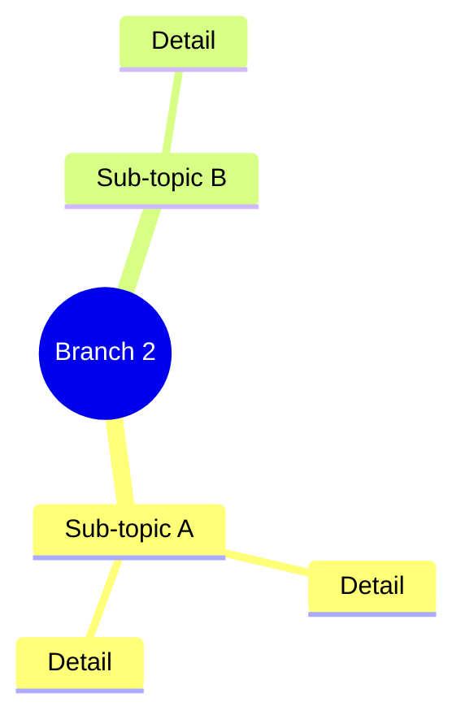
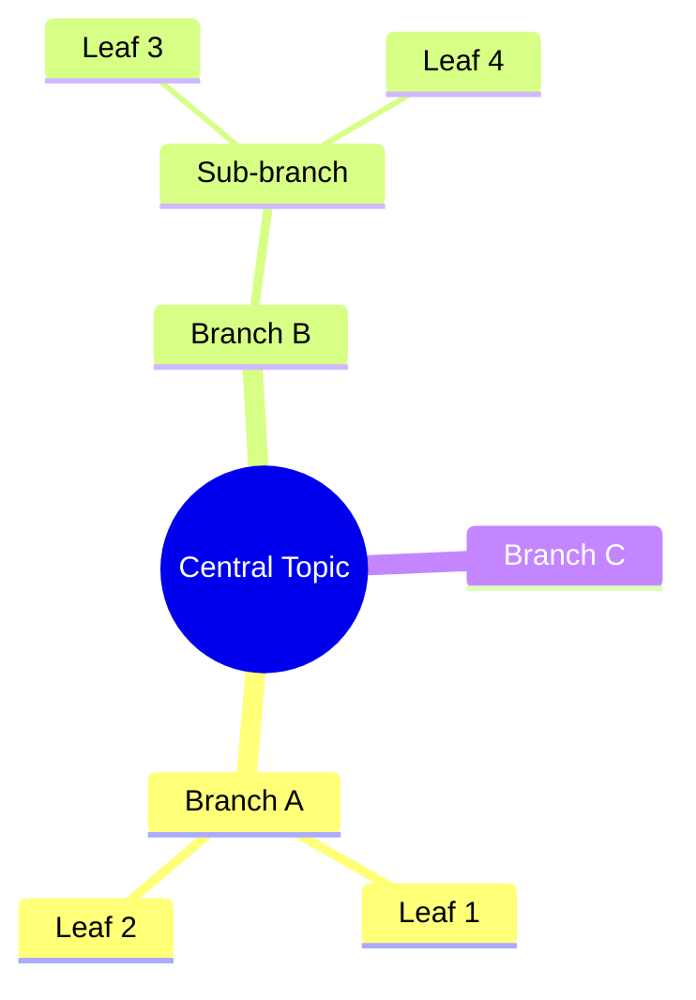

# Documentation Structure Reference

This reference defines the file structure, templates, and conventions for mind-map knowledge bases generated by Context Keeper.

## File Tree

```
project-folder/
  CLAUDE.md    # AI agent entry point — concise context, section index, glossary
  README.md    # The knowledge base — overview mindmap, sections, sub-mindmaps
```

Two files. The mindmap is the backbone — it defines the structure, and everything else flows from it.

## Design Principle: Mindmap First

The mindmap is not decoration — it's the structural backbone of the knowledge base. Every mindmap has two representations that must stay in sync:

1. **Mermaid diagram** — the visual rendering for humans on GitHub
2. **Linked navigation list** — a nested markdown list with anchor links, immediately below the Mermaid diagram, for AI agents and programmatic navigation

The workflow is:

1. **Design the mindmap** — decide the branches, hierarchy, and topology
2. **Add linked navigation** — mirror the mindmap as a nested list with clickable anchor links and brief descriptions
3. **Write sections** — flesh out each branch with detail text, tables, evidence
4. **When updating** — change the mindmap and linked list first, then update sections to match

**Structural consistency rule:** Every branch in the overview mindmap must have a corresponding `##` section, a linked navigation entry, and vice versa. If they diverge, the mindmap wins — update the linked list and sections to match. The same applies to sub-mindmaps and their `###` headings.

## README.md

The single knowledge base file. The overview mindmap at the top defines the document structure. Sub-mindmaps within sections define sub-section structure. Detail text, tables, and evidence hang off each mindmap node.

### Structure

1. **Title** — `# [Project Title]`
2. **Overview mindmap** — Mermaid mindmap showing all major topic branches
3. **Sources** — Links to origin materials (Slack, Docs, Jira, GitHub)
4. **Content sections** — One `##` section per major mindmap branch, in left-to-right order
5. **Open Questions** — Rollup of unresolved items with links to relevant sections
6. **Key People** — Contributors with handles and roles
7. **Key Terms** — Glossary of project-specific terminology

### Template

~~~markdown
# [Project Title]

```mermaid
mindmap
  root(([Short Topic Name]))
    Branch 1
      Key point
      Key point
    Branch 2
      Sub-branch
        Detail
    Branch 3
      Key point
    Open Questions
```

- [Branch 1](#branch-1) — brief description
  - [Key point](#key-point)
- [Branch 2](#branch-2) — brief description
  - [Sub-branch](#sub-branch) — brief description
- [Branch 3](#branch-3) — brief description
- [Open Questions](#open-questions)

## Sources

- **Origin:** [link to where this started]
- **Source document:** [link to primary doc]
- **Slack thread:** [link]

## Branch 1

[Detail text with tables, evidence, and links.]

## Branch 2



- [Sub-topic A](#sub-topic-a) — brief description
- [Sub-topic B](#sub-topic-b) — brief description

### Sub-topic A

[Detail text.]

### Sub-topic B

[Detail text.]

## Open Questions

- **[Question]** — [Context and link to section where discussed]

## Key People

- **Name** (`@handle`) — Role/contribution

## Key Terms

- **Term** — Short definition
~~~

### When to add sub-mindmaps

Add a sub-mindmap at the top of a section when:

- The section has **3+ sub-topics** with their own internal structure
- You're comparing **multiple options or alternatives**
- The section covers **multiple design areas** or concerns
- The visual map genuinely helps the reader navigate

Don't add sub-mindmaps for simple sections where a heading + text is sufficient.

## CLAUDE.md

AI agent entry point. Loaded automatically into every Claude Code session. Must stay under 50 lines.

### Contents

- One-line project description
- Links to source materials
- Section index for README.md (so the agent knows what's in each section without reading the full file)
- Glossary of key technical terms
- Related issue links

### Template

~~~markdown
# [Project Name] - Project Context

[One-sentence description.]

## Quick Context

- **Origin:** [link]
- **Source Doc:** [link]
- **Decision:** [one-line summary, if applicable]

## README.md Sections

| Section | What's in it |
|---|---|
| [Section Name](README.md#anchor) | Brief description |
| ... | ... |

## Key Terms

- **Term** — Short definition

## Related Issues

- [ISSUE-123](url), [ISSUE-456](url)
~~~

## Mindmap Design Guidelines

### Node text

- **2-6 words per node.** Nodes are labels, not sentences. Detail lives in the sections below.
- **Avoid special characters.** No parentheses, brackets, or quotes in node text — these conflict with Mermaid syntax. Colons and hyphens are fine.
- **Use consistent phrasing.** If one node says "Key Rotation", don't label another "How to rotate keys".

### Node shapes

- `((text))` — Circle. Use for root nodes.
- Default text (no brackets) — Rectangle. Use for most branches.
- `(text)` — Rounded rectangle. Use to highlight key decisions or outcomes.
- `[text]` — Square. Use sparingly for emphasis.

### Hierarchy

- **Overview mindmap:** 2-3 levels deep. Shows the forest, not the trees.
- **Sub-mindmaps:** 2-3 levels deep. Zoom into one branch.
- If you need more depth, split into another sub-mindmap in a child section.

### Linked navigation

Every Mermaid mindmap must be immediately followed by a linked navigation list — a nested markdown list that mirrors the mindmap structure:

```markdown
- [Branch Name](#anchor) — brief description
  - [Sub-branch](#anchor) — brief description
  - [Sub-branch](#anchor)
- [Branch Name](#anchor) — brief description
```

Rules:
- Mirror the mindmap structure exactly — same branches, same nesting
- Every entry is a clickable anchor link to the corresponding section/heading
- Add a brief description (3-10 words) after the link to help AI agents decide whether to navigate there
- When updating a mindmap, always update the linked list to match

### Mermaid syntax reference

~~~markdown

~~~

- Indentation defines hierarchy (2 spaces per level)
- First line after `mindmap` is the root node
- Nodes are plain text by default (rectangle shape)
- Use `((text))` for circle, `(text)` for rounded, `[text]` for square

## Linking Convention

Mindmap nodes cannot contain links. All clickable references go in the section text below the mindmap.

Every reference to an external resource must be a clickable markdown link:

- **Jira issues** — `[OCPSTRAT-918](https://issues.redhat.com/browse/OCPSTRAT-918)`
- **Slack threads** — `[#channel-name thread](https://slack-workspace.slack.com/archives/...)`
- **Google Docs** — `[Doc title](https://docs.google.com/document/d/...)`
- **GitHub issues/PRs** — `[repo#123](https://github.com/org/repo/issues/123)`
- **Internal sections** — `[Section Name](#anchor)` for cross-references within README.md

If you encounter a reference without a URL, look it up using available plugins or ask the user. Never write bare references.

## Formatting Conventions

- **Tables** for comparing options, listing scenarios, structured data
- **Code blocks** for API examples, YAML, CLI commands, error messages
- **Bold** for key terms on first use
- **Headers** — use liberally for scanning and navigation
- Short paragraphs (2-4 sentences)
- No emojis unless the user requests them
